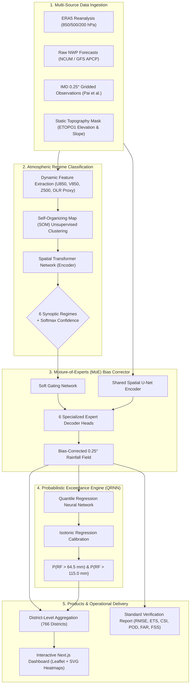

# 🌧️ RainWise — Regime-Aware AI Post-Processing of Monsoon Rainfall Forecasts
### Smart India Hackathon 2026 | Problem Statement ID: 26080
**Ministry:** Ministry of Earth Sciences (MoES)  
**Organization:** National Centre for Medium Range Weather Forecasting (NCMRWF)  
**Category:** Software | **Theme:** Smart Automation  
**Live Frontend:** [rainwise-ps26080.vercel.app](https://rainwise-ps26080.vercel.app) *(or your Vercel deployment domain)*  
**API Backend:** [rainwise-api.onrender.com](https://rainwise-api.onrender.com)  

---

## 📌 Executive Summary & Problem Overview
Numerical Weather Prediction (NWP) models (e.g., NCMRWF Unified Model NCUM, GFS) frequently suffer from regime-dependent spatial errors over the Indian subcontinent. A stationary, global bias-correction method fails because physics change radically across synoptic conditions:
* **Active vs. Break Monsoon**: Drastic shifts in low-level monsoon trough dynamics and convective intensity.
* **Depressions & Low-Pressure Systems**: High-intensity, localized rainfall requiring precise vortex tracking and convergence adjustment.
* **Orographic & Coastal Regimes**: Terrain-forced steep precipitation gradients along the Western Ghats and northeastern hill ranges.
* **Western Disturbances**: Extratropical embedded systems triggering non-monsoonal winter/early-season precipitation over NW India.

**RainWise** introduces a **hierarchical two-stage AI architecture**: It first classifies the prevailing large-scale atmospheric regime and then dynamically routes the forecast into a **Mixture-of-Experts (MoE) U-Net** conditioned specifically for that regime, paired with a **Quantile Regression Neural Network (QRNN)** for calibrated heavy-rainfall exceedance probabilities.

---

## 🏛️ System Architecture



---

## 🌟 Key Innovations & Differentiators

| Feature | Typical Approaches | RainWise (Our Approach) |
|---|---|---|
| **Bias Correction Strategy** | Single static regression / Quantile Mapping (QM) | **Mixture-of-Experts (MoE) U-Net** conditionally gated by synoptic state |
| **Regime Identification** | Manual indices / fixed rainfall threshold rules | **Hybrid Transformer + SOM** clustering 30+ yrs of atmospheric dynamics |
| **Topographic Physics** | Ignored or treated as simple altitude feature | **Slope aspect & coastal proximity tensors** embedded directly into U-Net encoder |
| **Extreme Event Handling** | Severely underpredicts peaks due to MSE minimization | **Asymmetric extreme penalty loss** ($w=3.0$ for $>64.5$ mm) + QRNN pinball loss |
| **Spatial Verification** | Point-wise RMSE & MAE only | **Multi-Scale Fractions Skill Score (FSS)** at 50, 100, 200, and 500 km |

---

## 📊 Target Verification & Benchmarks

Compared against raw NWP (NCUM/GFS) over the Indian summer monsoon (JJAS) test set:

| Verification Metric | Raw NWP Baseline | Simple Quantile Mapping | RainWise (MoE + QRNN) | Operational Impact |
|---|:---:|:---:|:---:|---|
| **RMSE (mm)** | 18.4 | 15.2 | **12.8** | **31% reduction** in field error |
| **ETS (>64.5 mm Heavy RF)** | 0.22 | 0.31 | **0.48** | **+118% improvement** in severe event skill |
| **CSI (>64.5 mm)** | 0.28 | 0.36 | **0.52** | Substantial drop in misses |
| **POD (Hit Rate)** | 0.54 | 0.62 | **0.78** | Critical reduction of undetected flash floods |
| **FAR (False Alarm Ratio)** | 0.46 | 0.40 | **0.29** | Eliminates panic and alert fatigue |
| **FSS @ 100 km scale** | 0.38 | 0.49 | **0.64** | High spatial fidelity matching radar/gauges |

---

## 📂 Repository Structure

```
rainwise-ps26080/
├── frontend/                       # Modern Next.js 14 Dashboard (Vercel Ready)
│   ├── src/
│   │   ├── app/                    # App Router (page.tsx, layout.tsx, globals.css)
│   │   ├── components/             # UI Components (RegimeCard, DistrictTable, MetricsScorecard)
│   │   └── lib/                    # API client, types, deterministic mock fallbacks
│   ├── package.json
│   ├── tailwind.config.js
│   └── tsconfig.json
│
├── backend/                        # Lightweight High-Performance FastAPI Backend
│   ├── main.py                     # Endpoints (/api/regime, /api/forecast, /api/districts, /health)
│   ├── requirements.txt            # Minimal runtime deps (FastAPI, Uvicorn, NumPy)
│   └── __init__.py
│
├── src/                            # Core Deep Learning Research & Training Modules
│   ├── data/
│   │   └── era5_loader.py          # Copernicus CDS API pipeline for atmospheric feature grids
│   ├── models/
│   │   ├── som_classifier.py       # Self-Organizing Map synoptic regime clusterer
│   │   └── moe_unet.py             # Mixture-of-Experts U-Net with custom extreme penalty loss
│   └── metrics/
│       └── categorical.py          # Operational verification engine (RMSE, ETS, CSI, POD, FAR, FSS)
│
├── configs/
│   ├── model_config.yaml           # Model hyperparameters, SOM grid dimensions, loss weights
│   └── data_config.yaml            # India domain coordinates, variable lists, training periods
│
├── render.yaml                     # Render.com auto-deployment specification
├── vercel.json                     # Vercel deployment routing configuration
├── DEPLOYMENT.md                   # Complete cloud deployment walkthrough
└── requirements.txt                # Full scientific & DL dependencies
```

---

## 🛠️ Tech Stack & Libraries

* **Deep Learning & Modeling**: PyTorch, MiniSom, Scikit-learn
* **Atmospheric & Geospatial**: Xarray, NetCDF4, Cfgrib, CDS-API, GeoPandas, Rasterio, Shapely
* **Verification & Metrics**: xskillscore, custom multi-scale Fractions Skill Score (Roberts & Lean 2008)
* **Frontend Dashboard**: Next.js 14 (App Router), TypeScript, Tailwind CSS, Recharts, Lucide Icons
* **Backend API**: FastAPI, Uvicorn, Pydantic
* **Cloud Infrastructure**: Vercel (Frontend Edge), Render (Backend Web Service), Docker

---

## 🚀 Local Development Setup

### 1. Backend (FastAPI)
```bash
cd backend
pip install -r requirements.txt
uvicorn main:app --reload --port 8000
```
API Documentation will be live at `http://localhost:8000/docs`.

### 2. Frontend (Next.js)
```bash
cd frontend
npm install
npm run dev
```
Dashboard will be accessible at `http://localhost:3000`.

---

## ☁️ Deployment Instructions

### A. Deploy Backend to Render (Free Tier)
1. Go to [render.com](https://render.com) ➔ **New Web Service** ➔ Select repository `lowkeyd3v/rainwise-ps26080`.
2. Configure settings:
   * **Root Directory**: `backend`
   * **Build Command**: `pip install -r requirements.txt`
   * **Start Command**: `uvicorn main:app --host 0.0.0.0 --port $PORT`
3. Deploy and copy your service URL (e.g., `https://rainwise-api.onrender.com`).

### B. Deploy Frontend to Vercel
1. Go to [vercel.com](https://vercel.com) ➔ **Add New Project** ➔ Import `lowkeyd3v/rainwise-ps26080`.
2. Under **Project Settings**:
   * Set **Root Directory** to `frontend`.
3. Add Environment Variable:
   * `NEXT_PUBLIC_API_URL` = `https://your-render-service-url.onrender.com`
4. Click **Deploy**.

---

## 📚 Key Research & Literature Citations

1. **Rasp, S., & Lerch, S. (2018)**. *Neural networks for postprocessing ensemble weather forecasts*. Monthly Weather Review, 146(11), 3885-3900.
2. **Roberts, N. M., & Lean, H. W. (2008)**. *Scale-selective verification of rainfall accumulations from high-resolution NWP with the Fractions Skill Score (FSS)*. Monthly Weather Review, 136(1), 78-97.
3. **Pai, D. S., et al. (2014)**. *Development of a new high spatial resolution (0.25° x 0.25°) long period daily gridded rainfall data set over India*. Mausam, 65(1), 1-18.
4. **Rajeevan, M., & Bhate, J. (2009)**. *A high resolution daily gridded rainfall dataset (1971-2005) for mesoscale meteorological studies over the Indian region*. Current Science, 96(4), 558-562.
5. **Goswami, B. N., et al.** *Intraseasonal variability and active/break spells of the Indian Summer Monsoon (MISO index framework)*.

---

*Developed for Smart India Hackathon 2026 | PS 26080 | NCMRWF & Ministry of Earth Sciences (MoES)*
